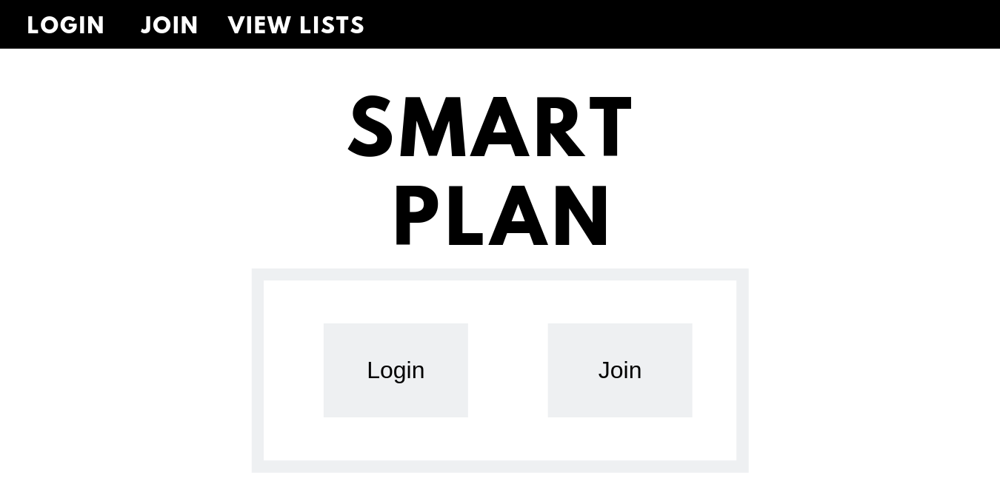
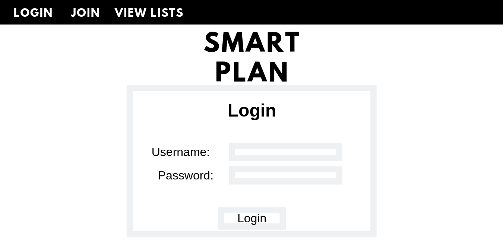
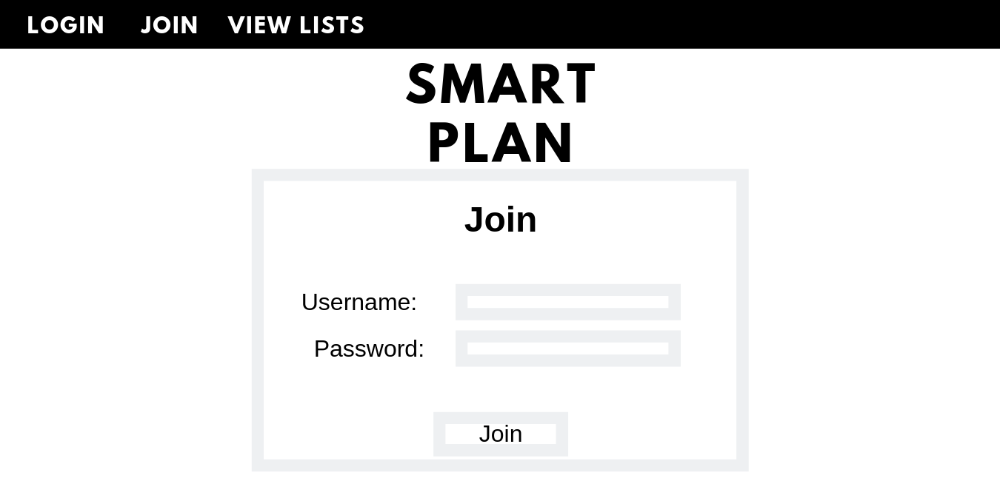
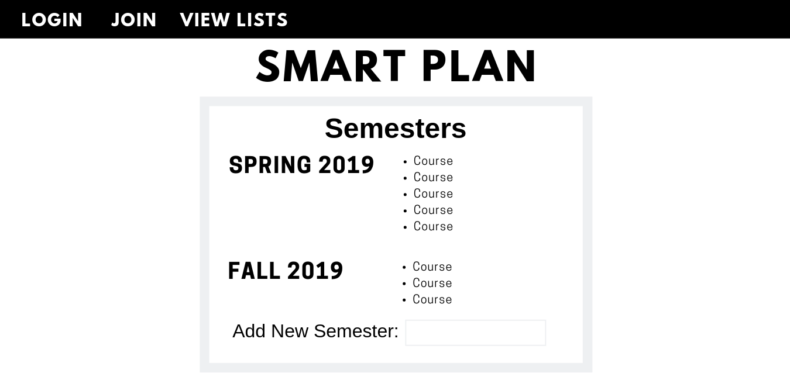
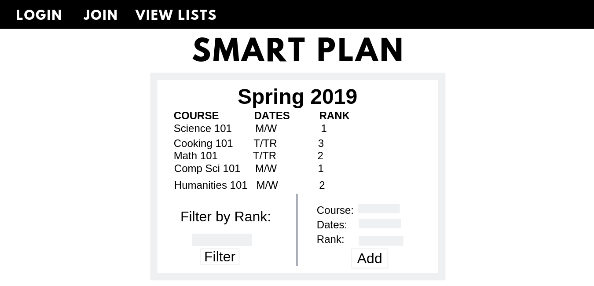
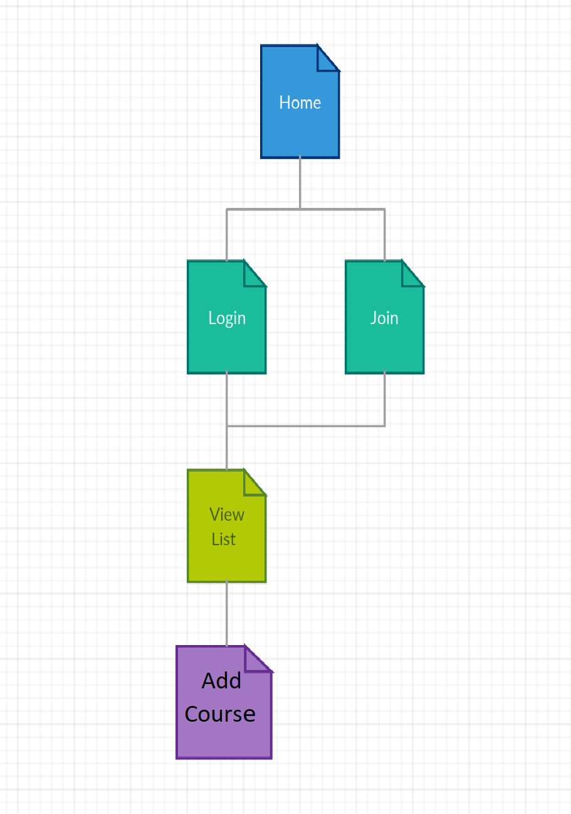

# Sayace-final-project: Smart Plan
final-project created for Sayace

## Overview
Planning for classes for the next semester can get messy when you have a unfavorable registration time. It's better to plan ahead by listing ALL the classes you might want to take just in case your top choices become waitlisted or closed.

Smart Plan is a web app that will allow users to list all the classes they are interested in for the next semester. Users can register and login. Once they're logged in they can see their list and add to it. While adding they can give each class they are interested in a rank number to keep track of which class they would prefer to take. There will be an option to filter the list based on rank if the user wishes to see what class they ranked as their first, second, or third choice.

## Data Model
The Smart Plan application will store users, lists, and courses

* users can have multiple lists for each semester (via references)
* each list can have multiple courses (also by references)

An Example User:

```javascript
{
  username: "student",
  hash: // a password hash,
  lists: // an array of references to List documents
}
```
An Example List:

```javascript
{
  user: // a reference to a User object
  name: "Spring 2019",
  courses: // an array of references to Course documents
}
```
An Example Course:

```javascript
{
  list: // a reference to a list object,
  name: "Science 101",
  dates: "M/W",
  rank: 1
}
```

## [Link to Commented First Draft Schema](db.js)

## Wireframes

/ - home page


/login - page to login


/join - page to create account


/view - display list of all semester plans already made


/view/semester - page for showing courses for a specific semester



## Site map


## User Stories or Use Cases

1. as non-registered user, I can register a new account with the site
2. as a user, I can log in to the site
3. as a user, I can view all of the semester plans I've made in a single list
4. as a user, I can add to the list of courses for a semester which will include name of course, dates, and rank
5. as a user, I can filter the list of courses based on the rank I assigned to a course

## Research Topics

* Integrate user authentication
    * 4 points
    * Will authenticate user which means we will use a middleware to make sure
    the user is who they say they are
    * Most likely using Passport
* Use a CSS framework throughout your site
    * 2 points
    * Will use bootstrap to make all pages consistent
    * Will also add mobile responsiveness
* Perform client side form validation
    * 2 points
    * Will see if the user inputted the correct values for creating a semester and creating a course
    * Will use custom javascript
    
8 points total out of 8 required points

## [Link to Initial Main Project File](app.js)

## Annotations / References Used

1. Will add once code is written
